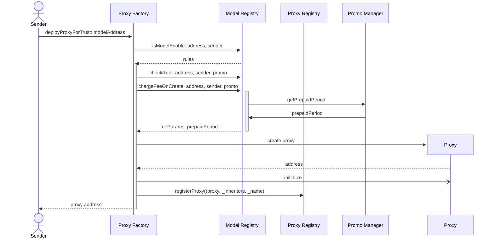

```mermaid
sequenceDiagram
  actor Customer as Sender
  participant Factory as Proxy Factory
  participant ModelReg as Model Registry
  participant ProxyReg as Proxy Registry
  participant PromoReg as Promo Manager
  
  activate Factory
  Customer ->> Factory: deployProxyForTrust: modelAddress
  Factory ->>+ ModelReg: isModelEnable: address, sender
  ModelReg -->>+ Factory: rules
  Factory ->>+ ModelReg: checkRule: address, sender, promo
  Factory ->>+ ModelReg: chargeFeeOnCreate: address, sender, promo
  activate ModelReg
  ModelReg ->> PromoReg: getPrepaidPeriod
  PromoReg ->> ModelReg: prepaidPeriod
  ModelReg -->> Factory: feeParams, prepaidPeriod
  deactivate ModelReg
  create participant Proxy
  Factory ->> Proxy: create proxy
  Proxy -->> Factory: address
  Factory -) Proxy: initialize
  Factory ->> ProxyReg: registerProxy((proxy, _inheritors, _name)
  Factory -->> Customer: proxy address
  deactivate Factory
```
